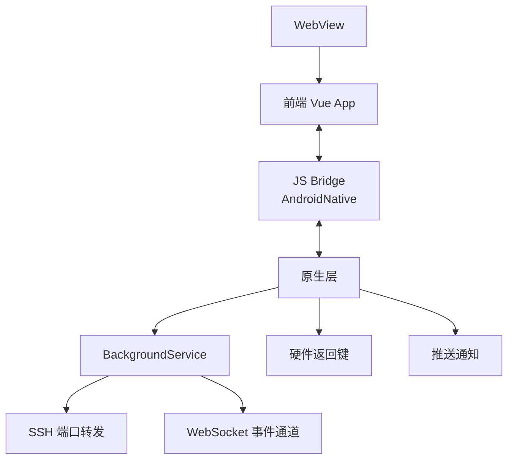
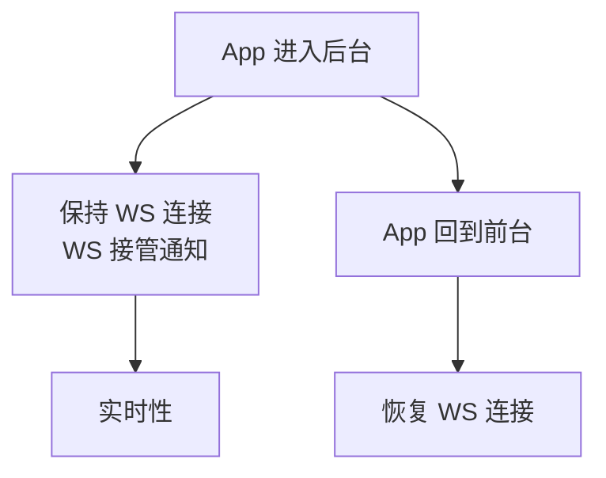

# Android 集成

Android 集成让 ClawBench 在手机上像一个原生 App 一样运行——WebView 承载前端界面，原生层提供后台服务、SSH 端口转发和硬件按键代理。App 进入后台时保持 WebSocket 连接以维持实时性。

## 流程图

### Android App 架构

### 后台策略

## 功能与设计要点

### 功能清单

- **WebView 容器**：Android WebView 承载前端 Vue App，通过 `AndroidNative` JS Bridge 暴露原生能力（获取密码、端口转发、文件操作等）。Web 和原生之间通过 Bridge 双向通信
- **后台服务（BackgroundService）**：管理 SSH 端口转发和原生 WebSocket 事件通道，App 在后台时仍能接收通知。没有后台服务，Android 杀进程后端口转发和通知都会中断
- **SSH 端口转发**：原生层建立 SSH 连接并维持端口转发，前端通过 `usePortForward` composable 控制。端口转发状态通过 `syncToNative()` 同步到原生层
- **硬件返回键代理**：Android `onBackPressed` 委托给 JS 层 `clawbench-back-press` 事件，JS 注册了处理器则拦截（不退出 App），未注册则传递给原生。Web 页面也能处理返回键
- **自动登录**：Android 通过 `AndroidNative.getPassword()` Bridge 获取密码自动登录，用户不需要在 App 内手动输入密码

### 设计要点

- **后台服务是端口转发的前提**：没有 BackgroundService，Android 杀进程后 SSH 端口转发断开，已转发的端口全部不可达。后台服务保持 SSH 心跳，维持隧道活跃
