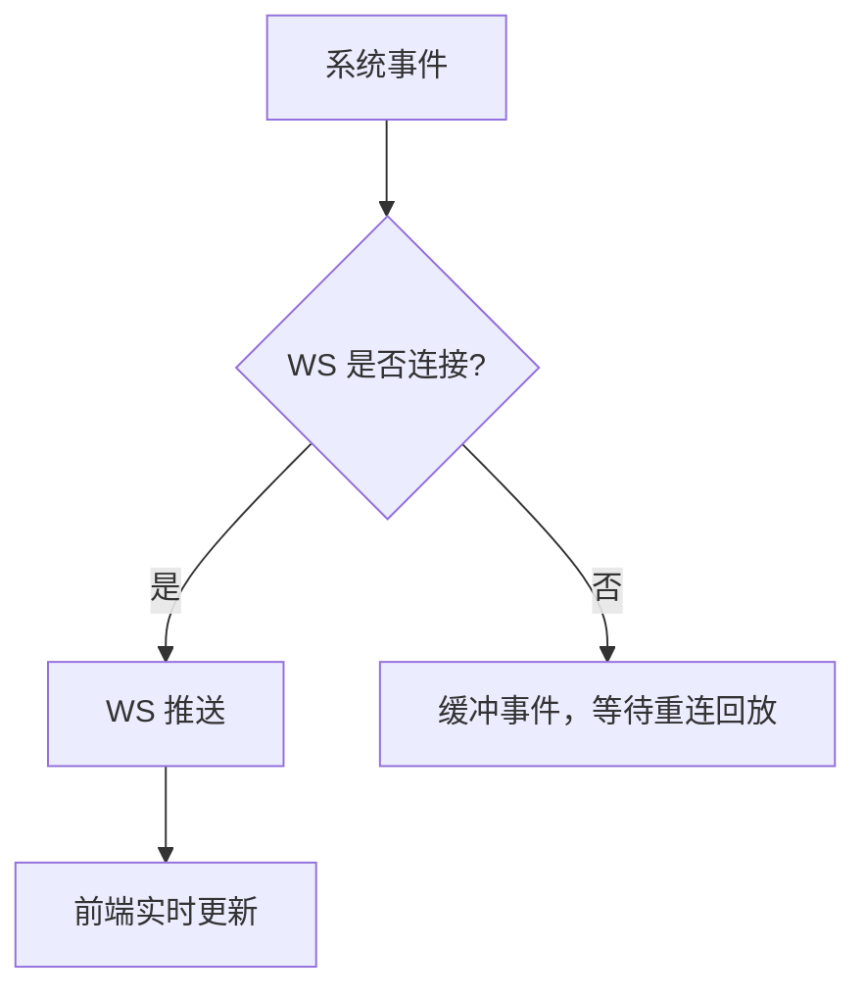
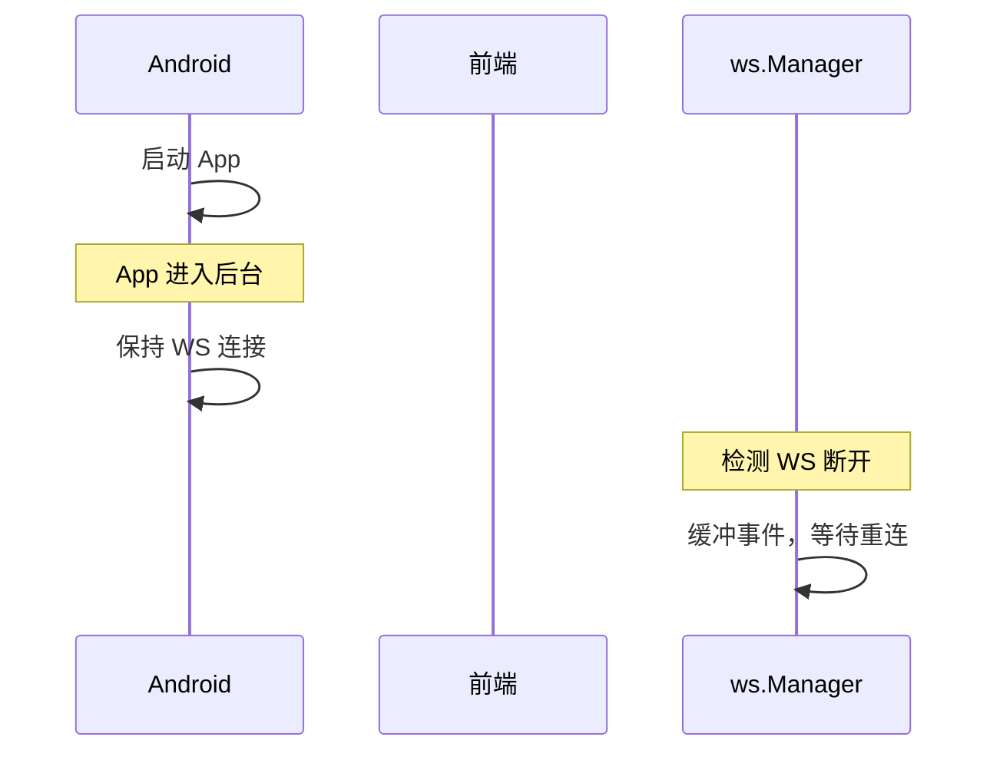
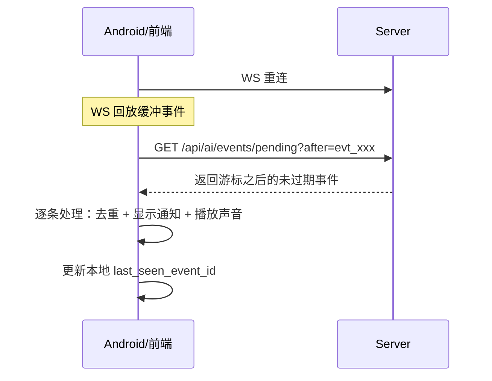

# 推送通知

推送通知让用户在手机息屏时也能收到 AI 执行完成、任务更新、权限审批等提醒。系统使用 WebSocket 作为实时通道，在线时通过 WebSocket 接收实时事件，离线时缓冲事件等待重连回放。Android 后台服务管理 SSH 端口转发的生命周期，确保推送通道始终可用。

## 流程图

### 推送策略

### WebSocket 事件生命周期

## 功能与设计要点

### 功能清单

- **WebSocket 实时事件**：在线时通过 WebSocket 接收实时事件（session_update、task_update 等），延迟更低、信息更丰富
- **事件缓冲与回放**：WebSocket 断线期间的事件缓冲在服务端，重连后自动回放。确保不丢失关键通知
- **任务完成推送预览**：WebSocket 通知包含任务完成的响应摘要预览文本和 `Done:` 前缀，用户不用打开 App 就能判断任务是否成功
- **权限审批推送**：ACP 后端请求工具调用审批时，WebSocket 通知包含工具名称（如 `execute_command`、`write_file`），用户可以及时审批，避免因未审批而阻塞 AI 执行

### 设计要点

- **推送是 WS 的后备而非替代**：推送通知有延迟、有字数限制、无法交互——在线时始终优先使用 WebSocket
- **断线缓冲窗口有限（10s）**：WebSocket 断线后只缓冲 10s 内的事件，超过的事件进入离线持久化

## 离线事件持久化

设备关机或网络断开期间，WS 连接丢失，10s 缓冲窗口内的事件也会丢失。为了确保离线期间的关键通知不丢失，系统将终端状态事件持久化到 `pending_events` 表。

### 持久化策略

- **只持久化终端状态事件**：`session_update`（completed/cancelled/permission_pending）、`task_update`（completed/failed/cancelled）
- **全局事件日志**：不按 client_id 分区，所有客户端共享同一个事件日志
- **条件存储**：仅当存在断开连接的客户端时才写入（`HasDisconnectedClients()`），避免所有客户端在线时的写放大
- **Write-ahead**：先存储后广播，确保事件日志无间隙
- **客户端游标**：每个客户端在本地持久化 `last_seen_event_id`，重连时用 `after` 参数拉取游标之后的事件
- **TTL**：
  - 终端状态事件（completed/cancelled/failed）：24 小时
  - 权限审批事件（permission_pending）：7 天（防止离线期间权限请求被清理导致 agent 死锁）
- **容量上限**：最大 1000 条，超出丢弃最旧的

### 拉取流程

### 去重

- **前端**：`processedEventIds` Set（cap 100），WS 回放和 pending fetch 共享同一去重集合
- **Android**：`processedEventIds` LinkedHashSet（cap 100），防止 WS 回放 + pending fetch 产生重复通知
