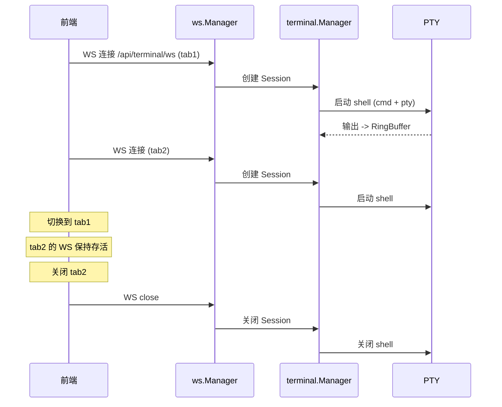
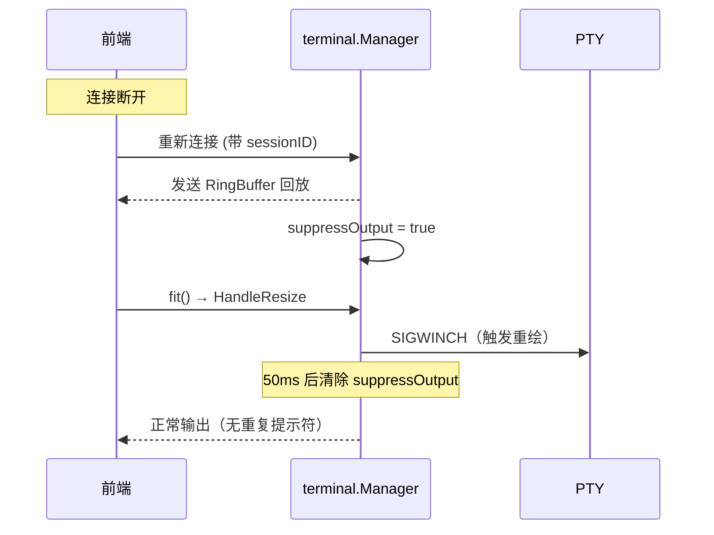

# Web 终端

Web 终端让用户在浏览器中直接访问服务器命令行——不需要 SSH 客户端，在手机上也能执行 `git status`、`docker ps` 等操作。后端通过 PTY 创建真实 shell 会话，前端用 xterm.js 渲染终端界面，WebSocket 双向传输输入输出。支持多标签页、手势操作、虚拟修饰键和自定义键位配置，适配移动端的交互限制。还支持 TUI 应用（如 vim、htop、OpenCode），提供完整的终端仿真体验。

## 流程图

### 终端多标签生命周期

### 断线重连与输出抑制

## 功能与设计要点

### 功能清单

- **多标签 PTY 会话**：支持同时打开多个终端标签页，每个标签页对应独立的 PTY 会话，最多 10 个并发会话。用户可以在不同标签页执行不同任务，切换时不丢失状态
- **可配置空闲超时**：空闲超时可配置（默认 0 = 永不超时），超时后自动关闭 PTY 释放资源。用户可根据需要选择"一直开着"或"自动清理"
- **断线重连与回放**：终端输出存储在 RingBuffer（2000 行、4MB 上限），WebSocket 重连后自动回放断线期间的输出，用户不会丢失已执行命令的结果
- **输出抑制**：重连后回放 buffer 期间自动抑制新输出，避免因 SIGWINCH 触发的重复提示符。50ms 后自动清除抑制，500ms 安全兜底防止永久抑制
- **TUI 应用支持**：设置 `TERM=xterm-256color` 和 `COLORTERM=truecolor` 环境变量，初始 PTY 尺寸 80x24，确保 vim、htop、OpenCode 等 TUI 应用正常渲染
- **手势交互**：支持双指捏合缩放字体、左右滑动切换终端，适配移动端的触控操作
- **虚拟修饰键**：Ctrl/Alt/Shift 三态状态机（inactive → once → locked），发送对应转义序列。解决移动端缺少物理修饰键的问题
- **键位与符号配置**：自定义虚拟键盘的按键和符号布局，配置持久化到数据库。用户可以添加常用的特殊符号，调整修饰键的排列
- **快捷指令**：预设常用命令一键发送（如 `git status`、`docker ps`），通过 `useCrudList` 管理 CRUD。与聊天快捷发送共享基础设施
- **键盘避让**：检测 Android 软键盘高度，自动调整终端视口，防止虚拟键盘遮挡终端内容

### 设计要点

- **单 WS 连接竞争**：每个 PTY 会话同一时刻只允许一个 WS 连接，新连接踢掉旧连接——PTY 不支持多路输入，多连接会导致输入混乱
- **RingBuffer 是有界环形缓冲**：固定容量，旧数据自动覆盖。这不是持久化方案，而是重连回放的临时缓冲——终端输出的历史价值随时间快速衰减
- **虚拟修饰键三态设计**：inactive（未激活）→ once（单次生效，发送后回到 inactive）→ locked（持续生效直到再次点击）。once 模式适合偶发的 Ctrl+C，locked 模式适合连续的 Ctrl 组合操作
- **输出抑制解决重连重复提示**：重连后发送 replay buffer + resize 会触发 shell 重绘提示符，导致用户看到重复的提示符行。抑制机制在 resize 后 50ms 内丢弃输出，既避免了重复又不丢失后续正常输出
- **标签页数受后端限制**：最大标签数由服务端 `terminal.max_sessions` 配置控制，前端据此禁用"新建标签"按钮——终端标签页的 PTY 是服务端资源，不能无限制创建
